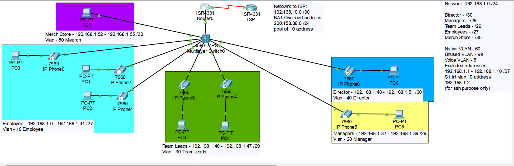

# Small Enterprise Network Simulation

A fully simulated small enterprise network built in **Cisco Packet Tracer**, designed to replicate a real-world small business environment with multiple departments, security policies, and scalable IP addressing. This project goes beyond practicing commands — every design decision reflects how a real network engineer would approach building a secure, manageable, and scalable enterprise network from scratch.

---

## Network Topology



> *Simulated in Cisco Packet Tracer. Topology includes a multilayer switch, router-on-a-stick setup, ISP connection, IP phones, and department-segmented VLANs.*

---

## Technology Summary

| Technology | Implementation Details |
|---|---|
| **VLSM** | Divides the `192.168.1.0/24` network into right-sized subnets per department — no wasted address space |
| **VLANs** | Each department is isolated into its own VLAN; unused ports assigned to VLAN 99 and shut down |
| **Router-on-a-Stick (ROAS)** | Inter-VLAN routing via subinterfaces on `GigabitEthernet0/0/1` of the ISR4331 router |
| **DHCP** | Router serves dynamic IP addresses per VLAN pool; Director and Merch Store use static IPs |
| **PoE** | Powers Cisco 7960 IP phones across all department VLANs via the multilayer switch |
| **Port Security** | Sticky MAC address learning on all active access ports; max 2 MACs; violation mode: restrict |
| **PortFast** | Enabled on all access ports to allow hosts to forward immediately without STP delay |
| **BPDU Guard** | Enabled on all PortFast interfaces to shut down the port if a switch is accidentally connected |
| **ACLs** | Restricts Employee and Merch Store from accessing other VLANs; blocks Management VLAN from internet |
| **PAT (NAT Overload)** | Translates all internal traffic to a pool of 10 public addresses (`200.158.35.1–.10`) |
| **DHCP Snooping** | Enabled on all VLANs; only the uplink trunk port is trusted |
| **DAI (Dynamic ARP Inspection)** | Validates ARP packets against DHCP snooping bindings; trunk port marked as trusted |
| **SSH** | All VTY lines restricted to SSH v2 only; console and VTY use local authentication |

---

## VLAN & IP Addressing Table

| VLAN | Name        | Subnet               | Usable Range                      | Gateway         | Hosts | DHCP    |
|------|-------------|----------------------|-----------------------------------|-----------------|-------|---------|
| 5    | Voice       | —                    | —                                 | —               | —     | —       |
| 10   | Employee    | 192.168.1.0/27       | 192.168.1.11 – 192.168.1.30       | 192.168.1.1     | 30    | Dynamic |
| 20   | Manager     | 192.168.1.32/29      | 192.168.1.33 – 192.168.1.38       | 192.168.1.33    | 6     | Dynamic |
| 30   | Team Leads  | 192.168.1.40/29      | 192.168.1.41 – 192.168.1.46       | 192.168.1.41    | 6     | Dynamic |
| 40   | Director    | 192.168.1.48/30      | 192.168.1.49 – 192.168.1.50       | 192.168.1.49    | 2     | Static  |
| 50   | Merch Store | 192.168.1.52/30      | 192.168.1.53 – 192.168.1.54       | 192.168.1.53    | 2     | Static  |
| 60   | Native VLAN | —                    | —                                 | —               | —     | —       |
| 99   | Unused      | —                    | —                                 | —               | —     | —       |
| 100  | Management  | 192.168.1.56/30      | 192.168.1.57 – 192.168.1.58       | 192.168.1.57    | 2     | Static  |

> **Excluded DHCP addresses:** `192.168.1.1 – 192.168.1.10` (reserved for network infrastructure)
>
> **S1 Management IP:** `192.168.1.58` (VLAN 100 SVI — used for SSH access only)
>
> **S1 VLAN 10 IP:** `192.168.1.2` (for SSH purposes only)

---

## ACL Design

### `Merge_Employee_Restriction`
Applied **outbound** on subinterfaces for VLAN 20, 30, 40, and 100.

**Purpose:** Prevents the Employee subnet (`192.168.1.0/27`) and Merch Store subnet (`192.168.1.52/30`) from reaching other department VLANs and the management network.

```
deny   192.168.1.0 0.0.0.31
deny   192.168.1.52 0.0.0.3
permit any
```

### `Block_Internet_Access`
Applied **outbound** on `Serial0/1/0` (WAN interface toward ISP).

**Purpose:** Prevents the Management VLAN (`192.168.1.56/30`) from reaching the internet. This is a precautionary measure — the management network only has 2 usable addresses, both already assigned to the router subinterface and the switch SVI, and is used exclusively for SSH-based switch management.

```
deny   192.168.1.56 0.0.0.3
permit any
```

---

## Design Decisions

**Why /30 for Director and Merch Store?**
Both departments have a fixed, small number of hosts with no plans for growth. A /30 provides exactly 2 usable addresses — one for the host and one for the router subinterface. Using a larger subnet would waste address space. Because both subnets are /30s with no room for a DHCP server reservation, devices in these subnets are configured with static IP addresses.

**Why VLAN 99 for unused ports?**
All inactive switch ports are assigned to VLAN 99 and administratively shut down. This follows the principle of least privilege — unused ports should have no network access by default, reducing the attack surface.

**Why VLAN 60 as the native VLAN instead of VLAN 1?**
Using VLAN 1 as the native VLAN is a well-known security risk (VLAN hopping attacks). A dedicated, unused native VLAN (60) is assigned to the trunk to mitigate this.

**Why is the Management VLAN blocked from the internet?**
VLAN 100 is used solely for SSH-based management of the multilayer switch. There is no legitimate reason for management traffic to reach the internet, and blocking it reduces the risk of the management plane being exposed to external threats.

**Why PortFast + BPDU Guard together?**
PortFast skips STP listening and learning states on access ports (hosts don't need STP). BPDU Guard complements this by immediately disabling any PortFast port that receives a BPDU — preventing someone from accidentally or maliciously connecting a switch and creating a Layer 2 loop.

**Why DHCP Snooping + DAI together?**
DHCP Snooping builds a binding table of legitimate IP-to-MAC-to-port mappings. DAI then uses this table to validate ARP packets, dropping any that don't match — preventing ARP spoofing and man-in-the-middle attacks on the LAN.

---

## NAT Configuration

| Parameter | Value |
|---|---|
| Type | PAT (NAT Overload) |
| Internal network | 192.168.1.0/24 |
| Public pool | 200.158.35.1 – 200.158.35.10 |
| ISP link | 192.168.10.0/30 |

---

## Security Summary

| Layer | Controls Applied |
|---|---|
| Physical / Layer 1 | Unused ports shutdown, assigned to VLAN 99 |
| Layer 2 | Port Security, DHCP Snooping, DAI, BPDU Guard, PortFast, Non-default native VLAN |
| Layer 3 | ACLs (inter-VLAN restriction, internet block), PAT/NAT |
| Management Plane | SSH v2 only, local authentication, management VLAN isolated |

---

## Future Improvements

1. **Redundancy** — Add a second switch and uplink for high availability; implement EtherChannel or HSRP
2. **Firewall** — Deploy a dedicated firewall (e.g., Cisco ASA) between the router and ISP for stateful inspection
3. **IPv6** — Dual-stack implementation across all VLANs
4. **Wireless** — Add a wireless LAN controller and access points for employee mobility
5. **Syslog / NTP** — Centralized logging and time synchronization for network visibility and auditing

---

## Tools Used

- **Cisco Packet Tracer** — Network simulation
- **Cisco ISR4331** — Edge router (ROAS, DHCP, NAT, ACL)
- **Cisco 3560-24PS Multilayer Switch** — Core switching (VLANs, port security, DHCP snooping, DAI)

---

## Author

Built as a portfolio project simulating a real-world small enterprise network.  
*Authorized Users Only.*
